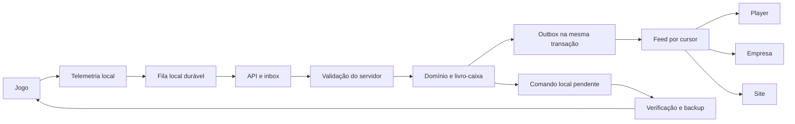

# RoadLedger — migração para sincronização por eventos

## Auditoria e limites (11/09/2026)
Projetos: RoadLedgerEmpresaVirtual, RoadLedgerPlayer e RoadLedgerSite, em ProjetosPython.
O site usa Django, REST e tokens com hash; api/company_api.py valida contratos, datas,
duplicidade, jogos e calcula comissões. api/models.py contém empresas, contratos,
fretes e missões oficiais, mas não um livro-caixa central.
O player usa services/employee_sync.py com employee_outbox e recibos locais. Finanças
e boletos estão em database/repository.py e services/bank_service.py.
A empresa usa src/roadledger/application e sincronização periódica com o site.
Existe recuperação de empresa por backup; ela não substitui contratos de API.
Os apps usam Tk/ttk. Não substituir por outro framework.
A sincronização do saldo com o jogo hoje é manual; leitura de telemetria não permite
escrever o saldo. Não ativar escrita automática por memória sem validar perfil/versão.

## Ordem de implantação
1. Auditoria e contratos.
2. API de eventos, inbox, outbox e cursor persistente.
3. Livro-caixa central e migração explícita dos saldos, sem recalcular histórico.
4. Assistentes persistentes de 12 etapas (empresa e player, ordem da especificação).
5. Fila local, retentativas e Central de Sincronização.
6. Adaptadores de entregas, boletos, multas, missões e comandos.
7. Testes integrados, publicação compatível e empacotamento limpo.

Cada etapa deve registrar resultados de testes; não ativar recursos financeiros
incompletos. Manter endpoints antigos durante a atualização dos clientes.

## Responsabilidades
Servidor: decisões financeiras, permissões, contratos e progresso validado.
Jogo: observações brutas. Não é comprovante independente de entrega.
Apps: fila durável, cache, configuração e execução local autorizada.
Site: consulta e administração do mesmo servidor.

## Contrato
Envelope v1: event_id, event_type, event_version, occurred_at, received_at, source,
user_id, company_id, driver_id, game, profile_id, save_id, correlation_id,
causation_id, idempotency_key, payload, metadata e schema_version.
Identidade e received_at são atribuídos pelo servidor. Eventos financeiros
concluídos nunca são aceitos como decisões vindas do cliente.
Chaves repetidas com conteúdo diferente são conflitos; chaves iguais são retomadas.
UUID identifica o evento; sequência de publicação identifica o cursor.
A publicação e a operação de domínio compartilham a mesma transação.
Uma linha de sequência bloqueada serializa a publicação para impedir lacunas
causadas por commits fora de ordem. O cursor só avança após persistência local.
A recuperação REST continua sendo necessária mesmo com notificações SSE/WebSocket.

## Riscos e capacidades pendentes
- Registros legados não têm identidade global para todas as operações.
- Importação de saldo precisa de conferência, titularidade e aprovação registrada.
- Multas não podem ser descontadas na entrega e novamente em boleto.
- Telemetria é controlada pelo cliente; autenticação não prova a veracidade da carga.
- Steam Cloud pode sobrescrever alterações. Nunca escrever em save ativo.
- Mods desconhecidos devem aparecer como não reconhecidos, sem bloqueio arbitrário.
- Configuração de permissões por cargo precisa ser centralizada; APIs atuais de gestão
  são restritas ao proprietário.
- Tempo real, economia central completa e assistentes ainda dependem das etapas seguintes.
- Não declarar pacote pronto para distribuição antes desses fluxos e testes.

## Dados existentes
Migrações novas devem ser aditivas e reversíveis. Não apagar migrações antigas.
Nenhum saldo antigo será importado ou recalculado automaticamente.
Não modificar bancos locais reais ou saves para executar testes.
